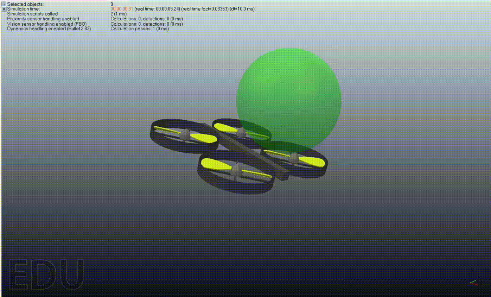

# RL Quadcopter Control

Model-free reinforcement learning for autonomous quadcopter flight control and stabilization. PPO and A2C agents learn to navigate and hover in 3D space without explicit physics models.

**Authors:** Nir Manor & Gil Gur Arieh  
**Last Updated:** December 2024

---

## 📋 Overview

This project implements deep reinforcement learning for autonomous quadcopter flight control. The agent learns to navigate and stabilize a drone in 3D space **without pre-programmed control models or prior knowledge of physics**. The system integrates:

- **High-fidelity physics simulation** (CoppeliaSim)
- **Custom Gymnasium environment** (16D state, 4D actions)
- **Deep RL algorithms** (PPO, A2C via Stable-Baselines3)
- **Multi-objective reward shaping**
- **Trained baseline agents** ready for research and evaluation

## 🎯 Key Features

✅ **Model-free learning** - No explicit control laws, pure deep RL  
✅ **Multiple algorithms** - Both PPO and A2C implementations with comparisons  
✅ **Realistic physics** - Full quadcopter dynamics in CoppeliaSim  
✅ **Custom environment** - Gymnasium-compatible with sophisticated design  
✅ **Trained agents** - Production-ready models (350k+ timesteps)  
✅ **Comprehensive docs** - Full technical report + code documentation  
✅ **Reproducible** - All hyperparameters, results, and training logs included  

## 🚀 Quick Start

### Installation

```bash
pip install -r requirements.txt
```

### Train a New Agent

```python
from DroneEnv import DroneEnv
from stable_baselines3 import PPO

env = DroneEnv(reward_type="mixed")
agent = PPO("MlpPolicy", env, gamma=0.95)
agent.learn(total_timesteps=100000)
agent.save("my_agent")
```

### Evaluate Trained Agent

```python
env = DroneEnv(reward_type="mixed")
agent = PPO.load("models/ppo_drone_agent", env=env)
obs, _ = env.reset()
for _ in range(1000):
    action, _ = agent.predict(obs, deterministic=True)
    obs, _, terminated, _, _ = env.step(action)
    if terminated:
        break
```

## 🔧 System Architecture

### State Space (16D)
- **Orientation (4D):** Quaternion [q_w, q_x, q_y, q_z]
- **Position (3D):** [x, y, z] in global frame
- **Linear Velocity (3D):** [v_x, v_y, v_z]
- **Angular Velocity (3D):** [α, β, γ] (Euler rates)
- **Target Position (3D):** [x_t, y_t, z_t]

### Action Space (4D)
- **Propeller Thrusts:** [T₁, T₂, T₃, T₄] ∈ [0, 3.18825] N

### Reward Function (Multi-Objective)
```
r(s) = c₀ - c₁(|α| + |β|) - c₂|z_drone - z_target| - c₃√[(Δx)² + (Δy)²]
```

- **c₀ = 50:** Positive baseline (encourage non-terminal steps)
- **c₁ = 5:** Pitch/roll penalty (stabilization)
- **c₂ = 10:** Vertical distance weight
- **c₃ = 5:** Horizontal distance weight

## 📊 Results

| Metric | Value |
|--------|-------|
| **Total Timesteps** | 350,000+ |
| **Training Time** | ~9 hours per 100k steps |
| **Algorithms** | PPO, A2C |
| **Network Architecture** | [128, 128] neurons |
| **Mean Reward** | +15 to +25 |
| **Best Sequence** | Sequence 3 (PPO) |

## 🗂️ Repository Structure

```
├── DroneEnv.py              # Gymnasium environment (16D state, 4D actions)
├── Drone_model.py           # CoppeliaSim interface & physics model
├── rl_main.py               # Training script with callbacks
├── drone_test.py            # Quick evaluation test
├── drone_simplified_model.ttt  # CoppeliaSim scene file
├── VREP_RemoteAPIs/         # CoppeliaSim remote API (Python bindings)
├── models/                  # Trained agents (PPO, A2C, multi-sequence)
├── logs/                    # Training evaluation logs
├── requirements.txt         # Dependencies
├── LICENSE                  # MIT License
└── README.md                # This file
```

## 🎓 Key Implementation Details

### Python-CoppeliaSim Synchronization

Solved critical synchronization challenges:

```python
# Synchronous mode - simulation pauses until step() called
sim.simxSynchronous(client_ID, True)

# Blocking reads ensure state is up-to-date
_, drone_quat = sim.simxGetObjectQuaternion(client_ID, heli_handle, -1,
                                             sim.simx_opmode_blocking)

# Paused writes ensure all thrusts sent atomically
sim.simxPauseCommunication(client_ID, True)
for i in range(4):
    sim.simxSetFloatSignal(client_ID, f'thrust_signal{i+1}',
                          thrust[i], sim.simx_opmode_oneshot)
sim.simxPauseCommunication(client_ID, False)

# Synchronous trigger advances simulation by one step
sim.simxSynchronousTrigger(client_ID)
```

### Multi-Stage Training

Different training stages focus on progressive objectives:

- **Sequence 0:** Orientation stabilization → Vertical tracking → Horizontal tracking
- **Sequence 1:** Total multi-objective reward with positive baseline
- **Sequence 2:** Randomized initialization + action space scaling
- **Sequence 3:** Curriculum learning + algorithm switching (A2C → PPO)

## 🏆 Major Challenges & Solutions

### 1. Synchronization
- **Challenge:** Asynchronous Python-CoppeliaSim communication led to stale states
- **Solution:** Synchronous mode, blocking API calls, paused communication

### 2. Reward Shaping
- **Challenge:** Naive goal-only reward resulted in suboptimal policies (e.g., slow descent)
- **Solution:** Multi-objective weighting + positive baseline + curriculum learning

### 3. Sample Efficiency
- **Challenge:** ~9 hours per 100k timesteps; recommanded 1M timesteps (90+ hours)
- **Solution:** Algorithm comparison (PPO vs A2C), hyperparameter tuning, curriculum learning

## 📚 Technical Details

See **Advance_Robotics_Project.pdf** for:
- Mathematical formulations
- Detailed algorithm descriptions
- Complete experimental methodology
- Ablation studies & hyperparameter analysis
- Future research directions

## 🔮 Future Work

### Short-term
- Parallel environments (10x training speedup)
- Domain randomization for robustness
- Alternative algorithms (TD3, SAC, DDPG)

### Medium-term
- Sim-to-real transfer validation
- Hardware deployment (Crazyflie, DJI)
- Multi-agent cooperation

### Long-term
- Formal safety guarantees
- Transfer learning across drone designs
- Real-world benchmark dataset

## 📖 Citation

```bibtex
@misc{Manor2024RLQuadcopter,
  title={RL Quadcopter Control: Model-Free Deep Reinforcement Learning for Autonomous Flight},
  author={Manor, Nir and Gur Arieh, Gil},
  year={2024},
  howpublished={GitHub},
  url={https://github.com/NirManor/rl-quadcopter-control}
}
```

## 👥 Authors

- **Nir Manor** - Autonomous Systems & Robotics  
  - GitHub: [@NirManor](https://github.com/NirManor)

- **Gil Gur Arieh** - Controls & Robotics  
  - Technion TASP Program

## 📝 License

MIT License - See [LICENSE](LICENSE) file for details.

## 🙏 Acknowledgments

- CoppeliaSim/V-REP team for excellent physics simulator
- Stable-Baselines3 team for robust RL implementations
- Gymnasium (formerly OpenAI Gym) for standard RL interfaces
- Technion TASP Program for research opportunities

---

**For questions or issues, please open a GitHub issue or contact the authors.**

**Last Updated:** December 2024

## Results & Performance

### Training Visualization



### System Architecture


### Quadcopter Equations


---

## Authors

- **Nir Manor** — https://github.com/NirManor
- **Gil Gur Arieh** — https://github.com/gilgurarieh

---

**Last Updated:** May 2024
